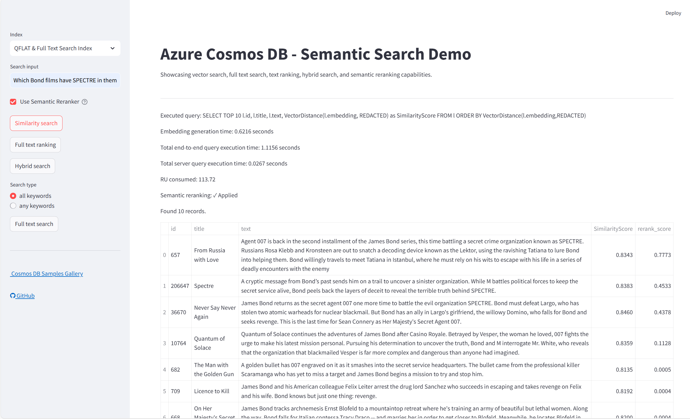

# Semantic Search Demo for Azure Cosmos DB

This repository contains a Python Streamlit application that demonstrates advanced search capabilities using Azure Cosmos DB, OpenAI embeddings, and semantic reranking. The application showcases vector search, full text search, text ranking, and hybrid search with intelligent semantic reranking to improve result relevance.



## ✨ Features

- **Multi-Modal Search Integration** with Azure Cosmos DB:
  - 🔍 **Semantic search** for movies using OpenAI embeddings
  - 📝 **Full text search** with advanced text processing
  - 🔄 **Hybrid search** combining semantic and full text search
  - 📊 **Text ranking** for enhanced result ordering
- **🎯 Semantic Reranking** (NEW):
  - Built-in Azure Cosmos DB SDK semantic reranking
  - Interactive UI toggle to enable/disable reranking
  - Preserves original metadata while improving result relevance
  - Uses DefaultAzureCredential for secure authentication
- **📈 Multiple Index Support**:
  - No Index baseline
  - QFLAT vector index for balanced performance
  - DiskANN vector index for high-scale scenarios
- **🛡️ Robust Error Handling**:
  - Graceful credential validation
  - Helpful troubleshooting messages
  - Fallback modes when services are unavailable
- **🎨 Interactive UI** built with Streamlit

## Prerequisites

- [Azure Cosmos DB](https://azure.microsoft.com/services/cosmos-db/) account with NoSQL API
  - **⚠️ IMPORTANT:** You must enable the following preview features in your Azure Cosmos DB account:
    - Navigate to your Cosmos DB account in the Azure Portal
    - Go to **Settings** → **Features**
    - Enable **"Vector Search for NoSQL API"** 
    - Enable **"Preview Features for Full Text Search"**
    - These features are required for vector indexing and full text search capabilities
- [Azure OpenAI](https://azure.microsoft.com/products/ai-services/openai-service) account
- [Azure CLI](https://docs.microsoft.com/cli/azure/install-azure-cli) (for local authentication)

## 🚀 Quick Start

### 1. Clone and Setup

```sh
git clone https://github.com/TheovanKraay/AzureDataRetrievalAugmentedGenerationSamples.git
cd AzureDataRetrievalAugmentedGenerationSamples/Python/CosmosDB-NoSQL_SemanticSearchDemo
```

### 2. Create and Activate Virtual Environment

Create a virtual environment at the project root:

```sh
python -m venv venv
```

**Activate the virtual environment:**

**PowerShell (Windows):**
```powershell
.\venv\Scripts\Activate.ps1
```

**Bash (Linux/macOS):**
```bash
source venv/bin/activate
```

### 3. Install Dependencies

```sh
pip install -r src/app/requirements.txt
```

### 4. Configure Environment Variables

Copy the template and configure your settings:

```sh
cp .env.template .env
```

Edit `.env` with your actual values:

```properties
# Azure Cosmos DB Configuration (Keyless Authentication)
COSMOS_URI=https://your-account.documents.azure.com:443/
COSMOS_DB_DATABASE=your_database_name

# Azure OpenAI Configuration  
AZURE_OPENAI_API_KEY=your_openai_api_key_here
AZURE_OPENAI_ENDPOINT=https://your-openai-resource.openai.azure.com/

# Azure Cosmos DB Semantic Reranker (Private Preview)
AZURE_COSMOS_SEMANTIC_RERANKER_INFERENCE_ENDPOINT=https://your-reranker-endpoint.dbinference.azure.com
```

### 5. Authentication Setup

The app uses **keyless authentication** with Azure Cosmos DB:

**🆔 DefaultAzureCredential (Recommended)**:
- Uses `DefaultAzureCredential` for secure authentication
- **Local Development**: Uses Azure CLI (`az login`)
- **Azure Deployment**: Uses Managed Identity automatically
- **Required**: Your identity needs "Cosmos DB Built-in Data Contributor" role
- **Benefits**: More secure, no secrets in configuration

### 6. Authenticate with Azure (Local Development)

```sh
az login
```

### 7. Load Sample Data

**⚠️ IMPORTANT:** You must load data into your Azure Cosmos DB database before running the application. The search functionality requires data to be present.

Make sure your virtual environment is activated, then run the data loader:

**PowerShell (Windows):**
```powershell
.\venv\Scripts\Activate.ps1
python src\data\data-loader.py --text_field_name "overview" --path_to_json_array "https://raw.githubusercontent.com/microsoft/AzureDataRetrievalAugmentedGenerationSamples/refs/heads/main/DataSet/Movies/MovieLens-4489-256D.json" --database_name "searchdemo2" --concurrency 5 --vector_field_name "vector" --re_embed True
```

**Bash (Linux/macOS):**
```bash
source venv/bin/activate
python src/data/data-loader.py --text_field_name "overview" --path_to_json_array "https://raw.githubusercontent.com/microsoft/AzureDataRetrievalAugmentedGenerationSamples/refs/heads/main/DataSet/Movies/MovieLens-4489-256D.json" --database_name "searchdemo2" --concurrency 5 --vector_field_name "vector" --re_embed True
```

**What this does:**
- Downloads the movie dataset (4,489 records) from GitHub
- Creates Azure Cosmos DB containers with vector and full text indexing
- Generates embeddings using Azure OpenAI
- Loads all data into both `search_qflat` and `search_diskann` containers
- Takes approximately 10-15 minutes to complete

**Note:** Make sure the `COSMOS_DB_DATABASE` in your `.env` file matches the `--database_name` parameter (e.g., "searchdemo2").

### 8. Run the Application

Make sure your virtual environment is activated, then choose one of the options below:

#### Option A: Without Semantic Reranker (Standard Features)

**PowerShell (Windows):**
```powershell
streamlit run src/app/cosmos-app.py --server.port 8501
```

**Bash (Linux/macOS):**
```bash
streamlit run src/app/cosmos-app.py --server.port 8501
```

#### Option B: With Semantic Reranker (Private Preview)

> **⚠️ PRIVATE PREVIEW**: The Azure Cosmos DB Semantic Reranker is currently in private preview. To enable this feature, please reach out to the Azure Cosmos DB team for access and to obtain your reranker endpoint.

**PowerShell (Windows):**
```powershell
$env:AZURE_COSMOS_SEMANTIC_RERANKER_INFERENCE_ENDPOINT="https://your-reranker-endpoint.dbinference.azure.com"; streamlit run src/app/cosmos-app.py --server.port 8501
```

**Bash (Linux/macOS):**
```bash
export AZURE_COSMOS_SEMANTIC_RERANKER_INFERENCE_ENDPOINT="https://your-reranker-endpoint.dbinference.azure.com"
streamlit run src/app/cosmos-app.py --server.port 8501
```

> **💡 Note**: Replace `https://your-reranker-endpoint.dbinference.azure.com` with your actual semantic reranker endpoint URL provided by the Azure Cosmos DB team.

## 🎯 Using the Semantic Reranker (Private Preview)

> **⚠️ PRIVATE PREVIEW**: The Azure Cosmos DB Semantic Reranker is currently in private preview. Contact the Azure Cosmos DB team to request access and obtain your reranker endpoint.

The application includes Azure Cosmos DB's built-in semantic reranker for improved search relevance:

### Features:
- **Built-in Integration**: Uses Azure Cosmos DB SDK `semantic_rerank()` method
- **Smart Ranking**: Reorders search results based on semantic similarity to your query
- **UI Toggle**: Enable/disable reranking with the checkbox in the sidebar
- **Metadata Preservation**: Maintains all original result data (IDs, titles, scores)
- **Seamless Authentication**: Uses the same DefaultAzureCredential as Cosmos DB

### How to Use:
1. **Ensure you have access**: Contact the Azure Cosmos DB team for private preview access
2. **Get your endpoint**: Obtain your semantic reranker inference endpoint URL
3. **Start the app**: Use Option B from the "Run the Application" section above
4. **Check the "Use Semantic Reranker" checkbox** in the sidebar

### How to Use:
1. **Start the application** following the instructions above
2. **Check the "Use Semantic Reranker" checkbox** in the sidebar
3. **Perform any search** (vector, text, or hybrid)
4. **Compare results** with and without reranking enabled
5. **View reranking status** in the results display

### Requirements:
- **Authentication**: Uses your existing Cosmos DB credentials (DefaultAzureCredential)
- **Azure Cosmos DB**: Account must support semantic reranking functionality

### Benefits:
- **Built-in SDK Integration**: No external API calls required
- **Consistent Authentication**: Uses your existing Cosmos DB credentials
- **Automatic Fallback**: App continues working even if reranking fails

## 📁 Project Structure

```
CosmosDB-NoSQL_SemanticSearchDemo/
├── src/
│   ├── app/
│   │   ├── cosmos-app.py          # Main Streamlit application
│   │   ├── requirements.txt      # Python dependencies
│   │   ├── .env.template         # Environment variable template
│   │   ├── .env                  # Your credentials (not in git)
│   │   └── venv/                 # Local virtual environment (optional)
│   └── data/
│       ├── data-loader.py        # Data ingestion script
│       └── drop-containers.py    # Container cleanup utility
├── venv/                         # Project virtual environment
├── README.md
└── .gitignore
```

## 🔧 Advanced Configuration

### Environment Variables Reference:

| Variable | Description | Required |
|----------|-------------|----------|
| `COSMOS_URI` | Azure Cosmos DB endpoint | ✅ |
| `COSMOS_DB_DATABASE` | Azure Cosmos DB database name | ✅ |
| `AZURE_OPENAI_API_KEY` | Azure OpenAI API key | ✅ |
| `OPENAI_ENDPOINT` | Azure OpenAI endpoint | ✅ |

*✅ = Required*

**Note**: Semantic reranking uses the built-in Cosmos DB SDK with your existing authentication credentials.

### Authentication:

**Cosmos DB & Semantic Reranker Authentication:**
- **Local Development**: Uses Azure CLI authentication (`az login`)
- **Azure Deployment**: Uses Managed Identity authentication automatically
- **DefaultAzureCredential**: Handles authentication flow seamlessly
- **Required Role**: "Cosmos DB Built-in Data Contributor" on your Cosmos DB account

## 🚀 Deploy to Azure with VS Code

### Prerequisites:
- Azure subscription with App Service capabilities
- VS Code with Azure App Service extension

### Steps:

1. **Install the Azure App Service extension**:
   - Open Extensions view (Ctrl+Shift+X)
   - Search for "Azure App Service" and install

2. **Create Azure Web App**:
   - Create [Azure Web App](https://learn.microsoft.com/azure/app-service/overview) 
   - Use Linux service plan (B1 SKU or higher)
   - Select Python 3.10+ runtime

3. **Configure App Service**:
   - Go to Configuration → General Settings
   - Set **Startup Command**:
     ```shell
     python -m pip install -r src/app/requirements.txt && python -m streamlit run src/app/cosmos-app.py --server.port 8000 --server.address 0.0.0.0
     ```
   - Add environment variables in Configuration → Application Settings

4. **Deploy**:
   - Press Ctrl+Shift+P
   - Select "Azure App Service: Deploy to Web App"
   - Select this project folder
   - Choose your subscription and Web App
   - Wait for deployment (up to 5 minutes)

### 🔐 Production Security:
- Use **Managed Identity** for Azure service authentication
- Store sensitive values in **Azure Key Vault**
- Configure **Application Settings** instead of .env files

## 📊 Loading Data into Cosmos DB

The app automatically creates containers with proper vector and text search policies. Use the data loader to populate with your data:

### Prerequisites for Data Loading:
1. **Environment Variables**: Ensure your `.env` file is configured with:
   - `COSMOS_URI`: Your Cosmos DB endpoint
   - `COSMOS_DB_DATABASE`: Target database name
   - `AZURE_OPENAI_API_KEY`: Your Azure OpenAI API key
   - `AZURE_OPENAI_ENDPOINT`: Your Azure OpenAI endpoint

2. **Virtual Environment**: Make sure your virtual environment is activated:
   ```sh
   .\venv\Scripts\Activate.ps1  # Windows PowerShell
   # or
   source venv/bin/activate     # Linux/macOS
   ```

### Data Loader Arguments:
- `--text_field_name`: Field containing text for embedding generation (required)
- `--path_to_json_array`: Path to JSON file or URL containing data array (required)
- `--database_name`: Cosmos DB database name (required)
- `--concurrency`: Number of concurrent operations (default: 1, recommended: 10-20)
- `--vector_field_name`: Field with pre-generated embeddings (optional)
- `--re_embed`: Whether to regenerate embeddings (default: False)

### Basic Usage:
```sh
cd src/data
python data-loader.py \
  --text_field_name "overview" \
  --path_to_json_array "your-data.json" \
  --database_name "searchdemo" \
  --concurrency 20 \
  --re_embed True
```

### Movie Dataset Example:
```sh
python src/data/data-loader.py \
  --text_field_name "overview" \
  --path_to_json_array "https://raw.githubusercontent.com/microsoft/AzureDataRetrievalAugmentedGenerationSamples/refs/heads/main/DataSet/Movies/MovieLens-4489-256D.json" \
  --database_name "searchdemo" \
  --concurrency 20 \
  --vector_field_name "vector" \
  --re_embed True
```

### Using Pre-existing Embeddings:
If your data already contains vector embeddings:
```sh
python src/data/data-loader.py \
  --text_field_name "text" \
  --path_to_json_array "data-with-vectors.json" \
  --database_name "searchdemo" \
  --vector_field_name "embedding" \
  --concurrency 10 \
  --re_embed False
```

> **💡 Note**: Use the same database name that you configured in the `COSMOS_DB_DATABASE` environment variable.

### 🗑️ Container Management:
Use the cleanup utility to remove containers:
```sh
python src/data/drop-containers.py
```

## 🤝 Contributing

1. Fork the repository
2. Create a feature branch: `git checkout -b feature/amazing-feature`
3. Commit changes: `git commit -m 'Add amazing feature'`
4. Push to branch: `git push origin feature/amazing-feature`
5. Open a Pull Request

## 📝 License

This project is licensed under the MIT License - see the LICENSE file for details.

## 🆘 Support & Troubleshooting

### Common Issues:

**❌ "Failed to connect to Cosmos DB"**
- Verify `COSMOS_URI` in .env
- Run `az login` to authenticate
- Check that your account has "Cosmos DB Built-in Data Contributor" role
- Check network connectivity to Azure

**❌ "Semantic reranking failed"**
- Ensure you're authenticated: `az login`
- Verify your account has access to the Cosmos DB account
- Check that the Cosmos DB account supports semantic reranking
- App will continue working with original search results

**❌ "No results found"**
- Ensure data is loaded into Cosmos containers
- Check container names match the app configuration

### Performance Tips:
- Use **DiskANN index** for large datasets (>100K documents)
- Use **QFLAT index** for balanced performance and cost
- Adjust **concurrency** in data loader based on Cosmos DB throughput

### 📞 Need Help?
- Check the [Issues](https://github.com/TheovanKraay/AzureDataRetrievalAugmentedGenerationSamples/issues) page
- Review Azure Cosmos DB [documentation](https://docs.microsoft.com/azure/cosmos-db/)
- Consult Azure OpenAI [best practices](https://docs.microsoft.com/azure/cognitive-services/openai/)
